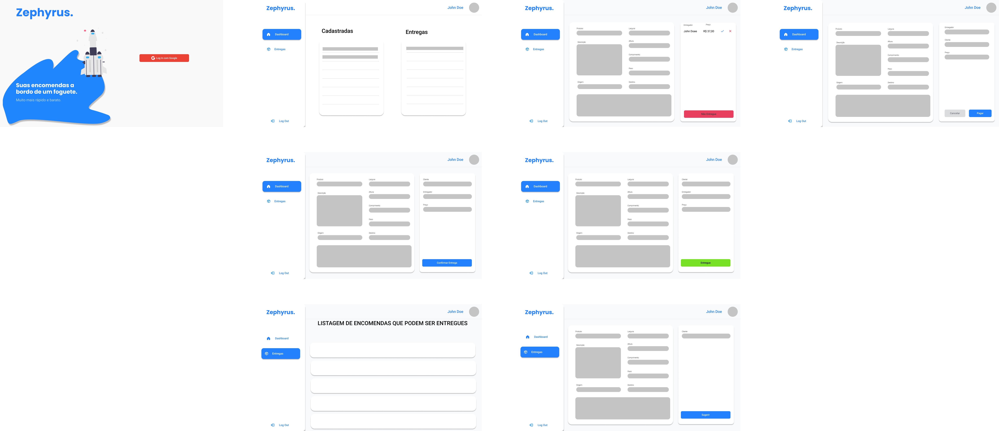

# App ToDo Application

  

<h1 align="center">App ToDo Applicaton</h1>

A kanban board style task manager.

<h3 align="center">
  
  
</h3>

 

## Preview

Sample preview:

## About

Delivered as a service, developed with React and integrated with Google's authentication API and Stripe for making payments

## API
- [Zephyrus API](https://github.com/YuutaDragon/api-zephyrus)

## Show your support

Give a ⭐️ if this project helped you!
